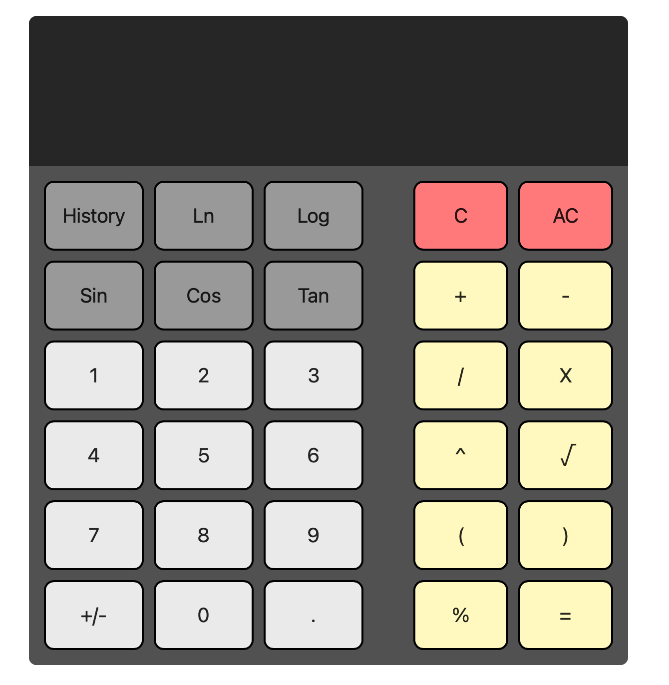

# Calcuator App
A simple, browser-based calculator built with HTML, CSS, and JavaScript.
Supports basic arithmetic operations, percentages, square root, sign toggle, 
trigonometric/logarithmic functions, and a calculation history panel

## ✨Features
- Responsive clean UI
- Keyboard support for numbers and operators
- Calculation history with option to clear
- Add, Subtract, Divide, Multiply
- Square root, percentage
- Sin, Cos, Tan
- Log, Ln

## 🚀Getting Started
- Clone the repository:
git clone https://github.com/ElliotH2/Calculator-app.git
cd Calculator-app
- Open index.html in your browser

## 🛠️Tools
- HTML5
- CSS
- Javascript (Vanilla)

## 📜 License
This project is licensed under the MIT License 
